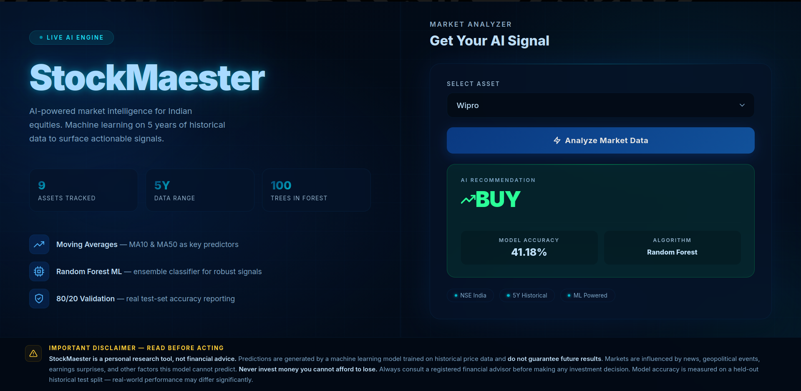
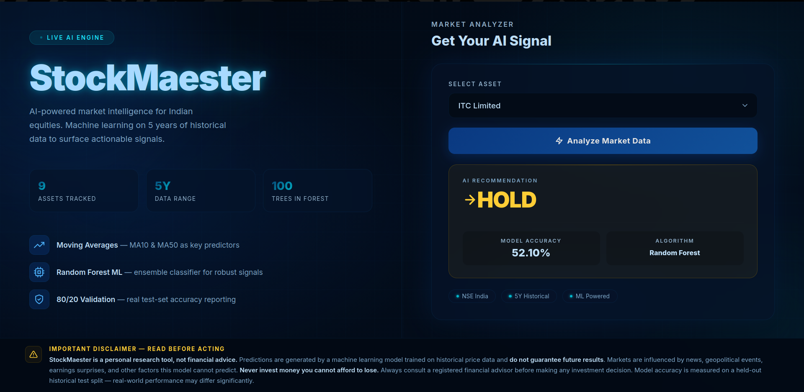
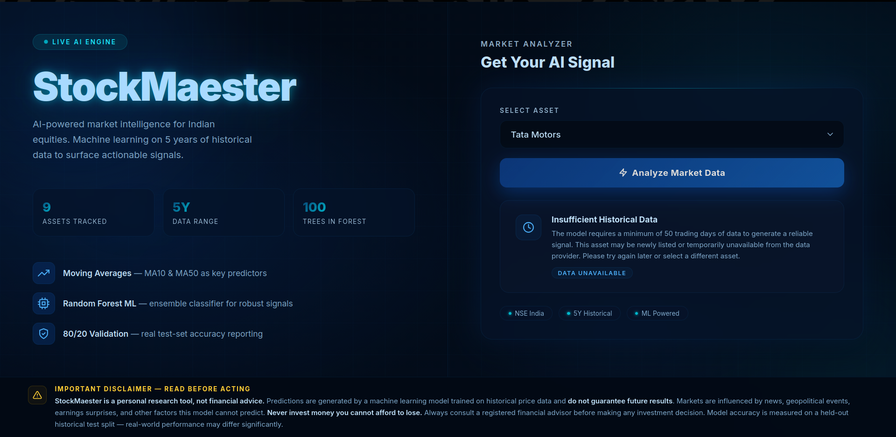

# StockMaester — AI Market Intelligence

> Real-time machine learning predictions for NSE-listed Indian equities, powered by a Random Forest classifier trained on 5 years of historical data.

---

## Preview

<!-- Add your screenshots below -->



---

## Overview

StockMaester is a full-stack ML web application that fetches live historical market data, engineers technical indicators on the fly, trains a Random Forest model, and surfaces a **BUY / HOLD / SELL** signal with a measured test-set accuracy score — all in a single browser interaction.

---

## Features

- **Live Data** — fetches up to 5 years of daily OHLCV data from Yahoo Finance via `yfinance`
- **7 Technical Indicators** — MA ratios, RSI, Bollinger %B, 1-day & 5-day returns, volume ratio
- **3-Class Classification** — BUY / HOLD / SELL with configurable ±1% daily move thresholds
- **Honest Accuracy Reporting** — chronological 80/20 train/test split with no data leakage
- **Balanced Learning** — `class_weight='balanced'` handles the HOLD-majority imbalance
- **Modular Architecture** — clean separation of config, ML pipeline, routes, and UI
- **Dark Blue UI** — glassmorphism design, SVG icons, animated background, full-viewport layout

---

## Tech Stack

| Layer | Technology |
|---|---|
| Language | Python 3.12 |
| Backend | Flask (Blueprint pattern) |
| ML | scikit-learn — `RandomForestClassifier` |
| Data | `yfinance`, `pandas` |
| Frontend | HTML5, CSS3 (Vanilla — no frameworks) |

---

## Supported Stocks (NSE)

| Name | Ticker |
|---|---|
| Reliance Industries | RELIANCE.NS |
| Tata Steel | TATASTEEL.NS |
| Infosys | INFY.NS |
| Tata Motors | TATAMOTORS.NS |
| HDFC Bank | HDFCBANK.NS |
| MRF Tyres | MRF.NS |
| Zomato | ZOMATO.NS |
| Wipro | WIPRO.NS |
| ITC Limited | ITC.NS |

---

## How It Works

```
User selects stock
       │
       ▼
yfinance downloads 5Y of daily OHLCV
       │
       ▼
Feature engineering
  ├── MA10_ratio   (Close / 10-day MA)
  ├── MA50_ratio   (Close / 50-day MA)
  ├── RSI_14       (14-period RSI)
  ├── BB_pct       (Bollinger Band %B)
  ├── Return_1d    (1-day return)
  ├── Return_5d    (5-day return)
  └── Volume_ratio (Volume / 20-day avg)
       │
       ▼
Chronological 80/20 split → measure accuracy on held-out 20%
       │
       ▼
Retrain on 100% of data → predict next day
       │
       ▼
Return BUY / HOLD / SELL + accuracy %
```

**Target labels:**

| Signal | Condition |
|---|---|
| **BUY** | Tomorrow's Close > Today × 1.01 |
| **SELL** | Tomorrow's Close < Today × 0.99 |
| **HOLD** | Everything else |

---

## Project Structure

```
StockMaester-StockPredictor/
├── app.py              # Application factory & entry point
├── requirements.txt
├── core/
│   ├── __init__.py
│   ├── config.py       # Constants, hyperparameters, stock universe
│   ├── predictor.py    # ML pipeline (fetch → engineer → train → predict)
│   └── routes.py       # Flask Blueprint — HTTP handlers
├── templates/
│   └── index.html      # Jinja2 template (pure HTML)
└── static/
    └── style.css       # All styles (dark blue glassmorphism theme)
```

---

## Quickstart

```bash
# 1. Clone
git clone https://github.com/Arshath-AD/StockMaester-StockPredictor.git
cd StockMaester-StockPredictor

# 2. Create virtual environment
python3 -m venv env
source env/bin/activate        # Windows: env\Scripts\activate

# 3. Install dependencies
pip install -r requirements.txt

# 4. Run
python3 app.py
```

Open `http://127.0.0.1:5000` in your browser.

---

## Model Configuration

All hyperparameters live in `core/config.py` — no touching the ML code to tune them:

| Parameter | Value | Why |
|---|---|---|
| `n_estimators` | 200 | Lower variance vs. 100 |
| `min_samples_split` | 10 | Allows deeper trees (was 100 — caused ~3-level shallow trees) |
| `max_depth` | 15 | Prevents overfitting on ~1,000 training rows |
| `class_weight` | `balanced` | Compensates for HOLD-majority class imbalance |

---

## Disclaimer

> **StockMaester is a personal research and portfolio project — not financial advice.**
> Predictions are generated by a machine learning model trained on historical price data and **do not guarantee future results**. Never invest money you cannot afford to lose. Always consult a registered financial advisor before making any investment decision.
